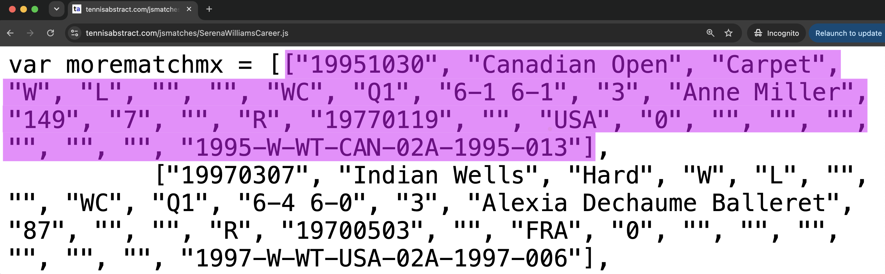

## About

This assignment is the continuation of HW1. This time you will take the
next step by implementing the "game plan" you described in the first assignment.

## Serena Williams's Career Matches

As we saw in HW1, the webpage containing the career matches of Serena Williams is given below:

<https://www.tennisabstract.com/cgi-bin/wplayer-classic.cgi?p=SerenaWilliams&f=ACareerqq>

::: {.callout-important}
Notice the date of birth of Serena Williams: `26-Sep-1981`
:::

### Main Data File

If you inspect the source code of the above webpage, you can find the following 
javascript file that has all the data (i.e. the necessary information) about 
Serena Williams's matches:

<https://www.tennisabstract.com/jsmatches/SerenaWilliamsCareer.js>

**Example: First Match**
:    Let's consider the first match that took place in October 30th 1995 (see 
highlighted data in the image below).

{width="80%"}

The data of this match is the **first element in the array of the javascript file** 
`SerenaWilliamsCareer.js` which contains, among other fields, 
the following values:

- Date of match: `"19951030"`
- Tournament: `"Canadian Open"`
- Surface: `"Carpet"`
- Whether Serena loses or wins: `"W", "L"` (lose) or `"W", "W"` (win)
- Name of opponent: `"Anne Miller"`
- Opponent's date of birth: `"19770119"`

## Deliverables

For this assignment, you will have a single GitHub repository (**individual submission**). 
Your repository should contain the following:

- One script file with code to download the raw data file (i.e. javascript file)

- One script file (`.py` or `.R`) to clean/process the raw data in order to 
produce the clean data set. This is the data `serena` to be used for graphing purposes
(recall that `serena` was mentioned in HW1).

- One script file (`.py` or `.R`) in which you import the `serena` data and produce the plot,
saved into an appropriate folder, e.g. `images/`, or `outputs/`, or `figures/`.

- One notebook (`.ipynb` or `.qmd`) or markdown file (`doc.md` or `report.md`) in which 
you insert the image (plot) file, and a brief narrative description for this assignment.

- An optional `ai_documentation.txt` file where you will describe the name an version of 
any AI tool used for this HW, as well as any prompts and output from such AI tool(s).

- A `Makefile` that includes:
    + `.PHONY` targets `all` and `clean`
    + rule to generate clean data
    + rule to generate the plot in PNG format
    + rule to produce the report in HTML format
    + rule to produce the report in PDF format
    + `all` rule to get the clean data, the plot, and the HTML/PDF reports
    + `clean` rule to remove clean data, plot, and HTML/PDF reports

- Add a Conda `environment.yml`

- A `README.md` file (at the top-level) with detailed contents about 
your HW assignment.

