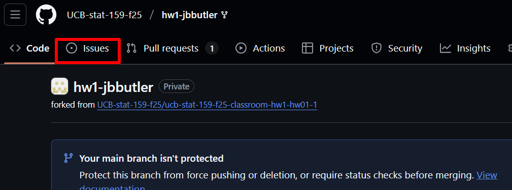
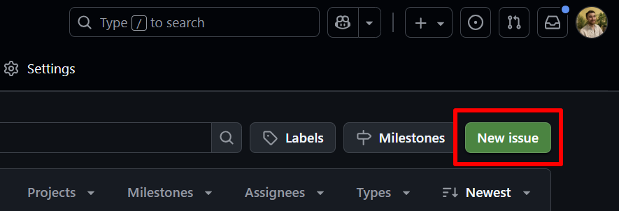
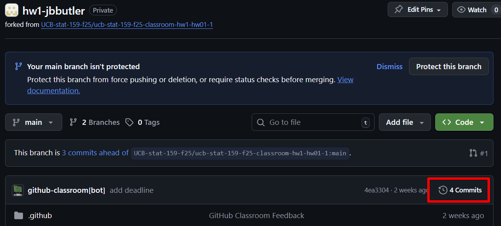

As part of your project-1 grade, you will be paired with another student and conduct 
a peer review of each other's project-1 using GitHub. This review takes the form of 
offering feedback on another student's work, including any comments related to 
reproducibility, effectiveness of documentation (code documentation, repo organization, 
commit messages, etc.), degree of similarity between the produced graphics and the 
original versions, or any comments related to coding practice (was there a more 
effective/cleaner way to write some piece of code?) or analysis (are there any 
other considerations you would like to see?).

You have been automatically added to another student's assignment repo, and another 
student has been added to your repo. You should see your peer’s repo in the list 
of repos you have access to, as part of the UCB-stat159-f26 organization. For the 
rest of this peer review, open your peer’s repository on the GitHub website.

Best practices when reviewing code: [This blog post](https://rewind.com/blog/best-practices-for-reviewing-pull-requests-in-github/) 
has some helpful guidance on giving constructive feedback on another person’s code.

## GitHub Issues

A useful tool to give feedback and comments on a GitHub repository is to 
open an Issue on GitHub.

### Task 1: General Issues

Let's practice just opening a general issue and making a comment about the 
repository structure. First, scan your peer's repository and ensure that all 
files that should be present are there (including `README.md`, `data/` files, 
`scripts/` files, `outputs/` images, etc).

1) Click the **Issues** tab

2) Click the **New Issue** button

3) Give a title to the issue, and in the body of the issue, 
comment on whether all of the files are present.

4) Create the issue. 

### Task 2: Use of Commits

Next, comment on your peer's use of commits. To see their commit history, 
go back to the home page of their repo, you should see a small clock icon 
with a counterclockwise arrow. Click it and it will take you to a page with 
all of their commits and commit messages.

Open a new issue, commenting on your peer's use of commits. 

- Is there only one commit with all of the work, or are there several commits 
that track the history of changes as they were made, incrementally? 

- Click on one of their commits to see exactly what was changed. 

- Does the commit message seem to concisely describe the changes made? 
Would you write a different commit message?

### Task 3: Line-Specific Issues

Now, we will practice opening issues that reference specific lines of a file. 
This will be especially useful for reviewing code scripts in the future, 
but for now we will use this to give comments and impressions on specific 
parts of your peer's work.

First, read through your peer's `README.md` file. Take note of any lines/sections 
of your peer's critique that you found interesting or surprising, or that 
you have questions about. 

1) Make sure you have the `README.md` file open in GitHub. Click **code**.

2) You should now see a line-by-line version of the file like a code script. 
Navigate to the line(s) that you'd like to comment on. If there is just one 
line you'd like to reference, click on the line number. If there are multiple, 
hold shift down while you click multiple lines.

3) The highlighted lines should be yellow. Click the ellipsis (`...`) next 
to the highlighted lines, and click **Reference in new issue**.

3) Give your comment a title and provide details as before, leaving the url text present.

4) **Create** the issue. You should see the text of your issue references the 
specific lines you highlighted.

5) Repeat this process for the other parts of your peer's critique that you 
found notable, or that you have questions about.
